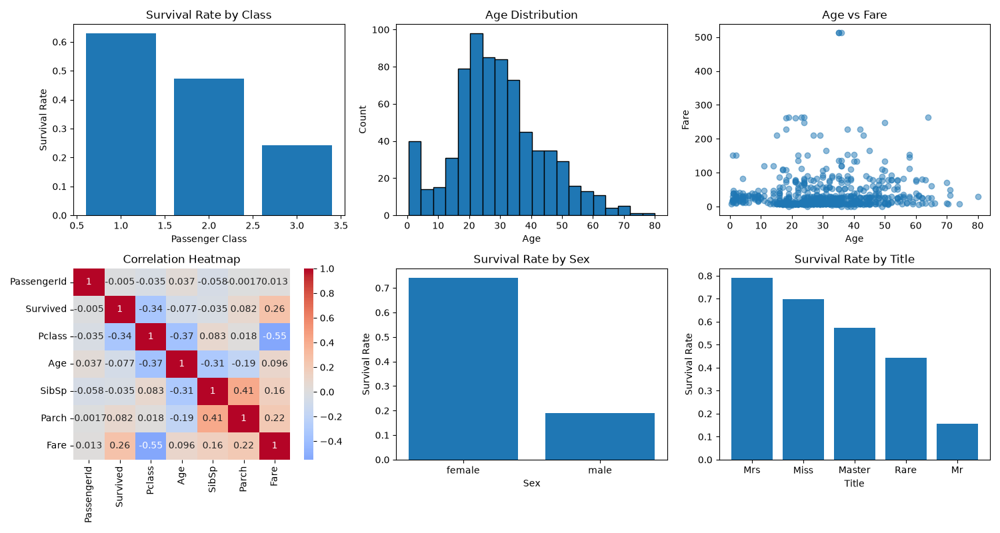

# Titanic EDA

Exploratory data analysis on the Titanic dataset, examining survival patterns
by passenger class, sex, and social title, with engineered features.

## Dataset
- Source: [datasciencedojo/datasets Titanic CSV](https://raw.githubusercontent.com/datasciencedojo/datasets/master/titanic.csv)
- 891 passengers, 12 original columns
- Missing `Age` values dropped only for the age-distribution histogram; not imputed elsewhere in this pass

## Feature Engineering
- `Title`: extracted from `Name` via regex, rare titles (Dr, Rev, Major, etc.)
  grouped into `Rare`
- `FamilySize`: SibSp + Parch + 1
- `IsAlone`: binary flag for solo travelers

## Key Insights
1. Survival by class: 63% (1st) vs 47% (2nd) vs 24% (3rd) — wealthier
   passengers had better access to lifeboats and crew assistance.
2. Survival by sex: 74% (women) vs 18% (men) — reflects the "women and
   children first" evacuation protocol.
3. Survival by title: Mrs 79% > Miss 69% > Master 57% > Rare 44% > Mr 15% —
   title captures both sex and life-stage, showing evacuation priority even
   more sharply than sex alone.

## Visualizations


## How to Run
```bash
pip install pandas matplotlib seaborn
python day13_eda.py
```

## Tools
Python, Pandas, Matplotlib, Seaborn